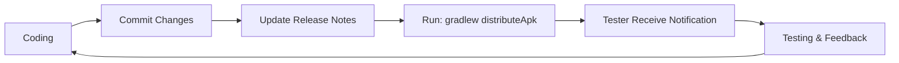
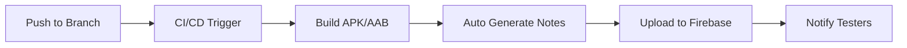

# 📱 Firebase Tutorial - App Distribution Integration

Proyek Android dengan integrasi lengkap Firebase App Distribution untuk otomatisasi distribusi aplikasi (APK/AAB) kepada tester.

## 📂 Struktur File Dokumentasi

```
Firebase Tutorial/
├── 📖 FIREBASE_APP_DISTRIBUTION_GUIDE.md  # Panduan lengkap & detail
├── 🚀 QUICKSTART.md                       # Quick start guide
├── 📋 README_DISTRIBUTION.md              # File ini
├── 🔧 setup-distribution.ps1              # Setup script (Windows)
├── 🔧 setup-distribution.sh               # Setup script (Linux/Mac)
│
├── 📄 build.gradle.kts.distribution       # Config untuk project level
├── 📄 app/build.gradle.kts.distribution   # Config untuk app level
│
├── 📝 release-notes.txt                   # Template release notes
├── 🔐 keystore.properties.example         # Template keystore config
├── 🌍 .env.example                        # Template environment variables
├── 🚫 .gitignore.distribution             # .gitignore yang aman
│
└── 🤖 CI/CD Configs
    ├── .github/workflows/
    │   └── firebase-distribution.yml      # GitHub Actions workflow
    └── .gitlab-ci.yml                     # GitLab CI config
```

## 🎯 Apa yang Sudah Disiapkan?

✅ **Dokumentasi Lengkap**
- Panduan step-by-step setup Firebase App Distribution
- Penjelasan setiap konfigurasi
- Troubleshooting guide
- Best practices untuk security

✅ **Konfigurasi Gradle**
- Plugin Firebase App Distribution
- Signing configuration untuk release build
- Custom Gradle tasks untuk otomatisasi
- Support untuk APK dan AAB

✅ **Custom Gradle Tasks**
- `distributeApk` - Distribusi APK otomatis
- `distributeAab` - Distribusi AAB otomatis
- `distributeWithAutoNotes` - Auto-generate release notes dari Git
- `quickDistribute` - Distribusi cepat tanpa clean
- `checkDistributionConfig` - Validasi konfigurasi

✅ **CI/CD Templates**
- GitHub Actions workflow
- GitLab CI configuration
- Support untuk automated testing dan deployment

✅ **Setup Scripts**
- Interactive setup script untuk Windows (PowerShell)
- Interactive setup script untuk Linux/Mac (Bash)
- Auto-detection dan validasi konfigurasi

## 🚀 Quick Start (3 Langkah)

### 1️⃣ Jalankan Setup Script

**Windows (PowerShell):**
```powershell
.\setup-distribution.ps1
```

**Linux/Mac:**
```bash
chmod +x setup-distribution.sh
./setup-distribution.sh
```

Script ini akan membantu Anda:
- Install Firebase CLI (jika belum)
- Membuat keystore untuk signing
- Setup kredensial dan environment variables
- Validasi konfigurasi
- Update file build.gradle.kts

### 2️⃣ Setup Firebase Console

1. Buka [Firebase Console](https://console.firebase.google.com/)
2. Pilih proyek Anda
3. Go to **App Distribution**
4. Buat grup tester:
   - Klik "Testers & Groups"
   - Buat grup baru (contoh: `qa-team`, `management`)
   - Tambahkan email tester ke grup

### 3️⃣ Distribusi Pertama

```powershell
# Windows
.\gradlew distributeApk

# Linux/Mac
./gradlew distributeApk
```

**Done!** 🎉 Tester Anda akan menerima email notifikasi dengan link download aplikasi.

## 📚 Dokumentasi

### 🆕 Baru Mulai?
Baca **[QUICKSTART.md](./QUICKSTART.md)** untuk panduan cepat.

### 📖 Butuh Detail Lengkap?
Baca **[FIREBASE_APP_DISTRIBUTION_GUIDE.md](./FIREBASE_APP_DISTRIBUTION_GUIDE.md)** untuk:
- Setup detail step-by-step
- Penjelasan setiap konfigurasi
- Cara membuat keystore
- Otentikasi Firebase
- Integrasi CI/CD lengkap
- Troubleshooting

## 🎮 Commands yang Tersedia

| Command | Deskripsi |
|---------|-----------|
| `.\gradlew distributeApk` | 🚀 Clean, build APK, upload ke Firebase |
| `.\gradlew distributeAab` | 📦 Clean, build AAB, upload ke Firebase |
| `.\gradlew distributeWithAutoNotes` | 📝 Distribusi dengan release notes auto-generated |
| `.\gradlew quickDistribute` | ⚡ Distribusi cepat (tanpa clean) |
| `.\gradlew checkDistributionConfig` | ✅ Validasi konfigurasi |
| `.\gradlew assembleRelease` | 🏗️ Build APK release saja |
| `.\gradlew bundleRelease` | 📦 Build AAB release saja |
| `.\gradlew appDistributionUploadRelease` | ⬆️ Upload build yang sudah ada |

## ⚙️ Cara Mengaktifkan Firebase App Distribution

### Opsi 1: Gunakan Setup Script (Recommended)

```powershell
# Windows
.\setup-distribution.ps1

# Linux/Mac
./setup-distribution.sh
```

Setup script akan otomatis backup file lama dan mengapply konfigurasi baru.

### Opsi 2: Manual

1. **Backup file existing:**
   ```powershell
   Copy-Item build.gradle.kts build.gradle.kts.backup
   Copy-Item app\build.gradle.kts app\build.gradle.kts.backup
   ```

2. **Apply konfigurasi baru:**
   ```powershell
   Copy-Item build.gradle.kts.distribution build.gradle.kts
   Copy-Item app\build.gradle.kts.distribution app\build.gradle.kts
   ```

3. **Setup keystore.properties:**
   ```powershell
   Copy-Item keystore.properties.example keystore.properties
   # Edit file dan isi dengan kredensial Anda
   ```

4. **Sync Gradle:**
   ```powershell
   .\gradlew --refresh-dependencies
   ```

## 🔐 Security Checklist

**JANGAN PERNAH commit file berikut ke Git:**

- ❌ `keystore/*.jks` - Keystore file
- ❌ `keystore.properties` - Kredensial keystore
- ❌ `.env` - Environment variables
- ❌ `firebase-service-account.json` - Service account credentials

**Gunakan `.gitignore.distribution` yang sudah disediakan:**

```powershell
# Replace .gitignore dengan versi aman
Copy-Item .gitignore.distribution .gitignore
```

## 🤖 CI/CD Integration

### GitHub Actions

File `.github/workflows/firebase-distribution.yml` sudah disediakan dan siap digunakan.

**Setup Secrets di GitHub:**

1. Go to: Repository → Settings → Secrets and variables → Actions
2. Tambahkan secrets:
   - `KEYSTORE_BASE64` - Keystore dalam format Base64
   - `KEYSTORE_PASSWORD` - Password keystore
   - `KEY_ALIAS` - Alias key
   - `KEY_PASSWORD` - Password key
   - `FIREBASE_TOKEN` - Token dari `firebase login:ci`

**Encode keystore ke Base64:**
```powershell
# Windows
[Convert]::ToBase64String([IO.File]::ReadAllBytes("keystore/release-keystore.jks"))
```

### GitLab CI

File `.gitlab-ci.yml` sudah disediakan dan siap digunakan.

**Setup Variables di GitLab:**

1. Go to: Project → Settings → CI/CD → Variables
2. Tambahkan variables yang sama seperti GitHub Actions

## 🎓 Workflow Penggunaan

### Development Flow



### CI/CD Flow



## 🛠️ Konfigurasi Lanjutan

### Custom Release Notes

Edit `release-notes.txt` sesuai kebutuhan atau gunakan auto-generation:

```powershell
.\gradlew distributeWithAutoNotes
```

Auto-generation akan include:
- Version name & code
- Git commit hash
- Git branch
- Author name
- Timestamp

### Multiple Build Variants

Tambahkan konfigurasi untuk variant lain di `app/build.gradle.kts`:

```kotlin
buildTypes {
    debug {
        configure<com.google.firebase.appdistribution.gradle.AppDistributionExtension> {
            groups = "internal-testers"
            releaseNotes = "Debug build"
        }
    }
    staging {
        configure<com.google.firebase.appdistribution.gradle.AppDistributionExtension> {
            groups = "qa-team"
            releaseNotes = "Staging build for QA"
        }
    }
}
```

### Multiple Tester Groups

```kotlin
configure<com.google.firebase.appdistribution.gradle.AppDistributionExtension> {
    groups = "qa-team, management, beta-testers, stakeholders"
}
```

## 📊 Monitoring & Analytics

Setelah distribusi, Anda dapat monitoring di Firebase Console:

1. **Dashboard Overview**
   - Total downloads
   - Tester engagement
   - Crash reports

2. **Release Details**
   - Download statistics per release
   - Tester feedback
   - Installation success rate

3. **Tester Management**
   - Active testers
   - Last activity
   - Feedback history

## ❓ Troubleshooting

### Error umum dan solusinya:

**1. "Firebase token not found"**
```powershell
$env:FIREBASE_TOKEN="your-token-here"
```

**2. "Keystore not found"**
- Cek path di `keystore.properties`
- Pastikan file keystore ada di folder yang benar

**3. "No testers or groups specified"**
- Tambahkan `groups` atau `testers` di konfigurasi
- Pastikan grup sudah dibuat di Firebase Console

**4. Upload gagal**
- Cek koneksi internet
- Verifikasi Firebase token masih valid
- Cek log detail: `.\gradlew distributeApk --info`

Untuk troubleshooting lengkap, lihat [FIREBASE_APP_DISTRIBUTION_GUIDE.md](./FIREBASE_APP_DISTRIBUTION_GUIDE.md#troubleshooting)

## 📞 Support & Resources

- 📖 [Firebase App Distribution Docs](https://firebase.google.com/docs/app-distribution)
- 🔌 [Gradle Plugin Docs](https://firebase.google.com/docs/app-distribution/android/distribute-gradle)
- 🤖 [Android App Signing](https://developer.android.com/studio/publish/app-signing)

## ✅ Checklist Implementasi

Gunakan checklist ini untuk memastikan setup lengkap:

- [ ] Install Firebase CLI
- [ ] Login Firebase dan dapatkan token
- [ ] Buat keystore untuk signing
- [ ] Setup `keystore.properties`
- [ ] Download `google-services.json` dari Firebase Console
- [ ] Buat tester groups di Firebase Console
- [ ] Update `build.gradle.kts` files
- [ ] Test distribusi dengan `.\gradlew checkDistributionConfig`
- [ ] Jalankan distribusi pertama dengan `.\gradlew distributeApk`
- [ ] Verifikasi tester menerima notifikasi
- [ ] Setup CI/CD (opsional)
- [ ] Update `.gitignore` untuk security

---

## 🎉 Selamat!

Anda sekarang memiliki sistem distribusi aplikasi yang fully automated! 

**Next Steps:**
1. Jalankan `.\gradlew distributeApk` untuk distribusi pertama
2. Monitor download di Firebase Console
3. Kumpulkan feedback dari tester
4. Iterate dan improve!

**Happy Distributing! 🚀**
